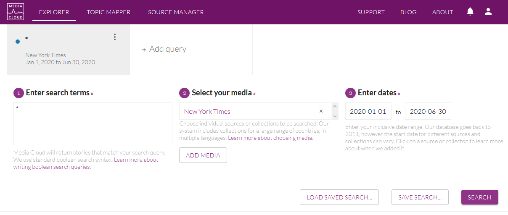

# Data collection {#data_collect}

```{r, echo=FALSE, message=FALSE, warning=FALSE}
library(knitr)
knitr::opts_chunk$set(echo = FALSE, warning = FALSE, message = FALSE)
library(quanteda)
```

We can have different use of data, depending on the amount of text available. Basically, we will distingush between three cases corresponding to three levels of information :

- **title of news** : typically, the case of data downloaded on mediacloud
- **title of news** + description : typically the case of data obtained by webscrapping of RSS flows and parsing of the XML code.
- **full text of *news** : typically the data obtained through a private provider of newspapers (Factiva, EuroPresse, LexisNexis ...) of by (non legal) scrapping of text through the URL's. 


## DATA LEVEL 1 : Title of news

### Download titles with mediacloud interface

We suppose that you want to analyze the title of the news collected by the New York Times during the first semester of 2020. You can easily proceed to such a collection with the application Mediacloud.

https://explorer.mediacloud.org

You need firstly to register (for free) in order to create an account. Then you can select your media, select your period and select all stories by using the request '*' as in the example presented below.

```{r}

```

Below your request, you obtain a graphic entitled *Attention Over Time* with the distribution of the number of news published per day which help you to verify if the distribution of news is regular through time. In our example, you an notice a classical week cycle (with decrease of the number of news publish during the week-end). But you can also observe a discontinuity at the beginning of May 2020 with a decline to a lower level of production of news. 

```{r}
knitr::include_graphics("pics/mc002.png")
```
Going down, you will find a news panel entitled *Total Attention* which gives you the total number of stories found. In our example, we have a total of 47522 stories produced by the NYT during the first semester of 2020. 

```{r}
knitr::include_graphics("pics/mc003.png")
```

Finally, by clicking on the button *Download all story URLS*, you can get a .csv file that you can easily load in your favorite porgramming language. In the case of R, you can load it with a program like this. 

```{r loadcsv, echo=TRUE}
df<-read.csv(file = "_data/mc/en_USA_nytime_20200101_20200630.csv",
             sep=",",
             header=T,
             encoding = "UTF-8",
             stringsAsFactors = F)
str(df)
```
**N.B.** We can notice, without being able to explain this fact, that the number of stories downloaded (30265), which is less than what was announced by the mediacloud interface (47522). May be it is related to the elimination of duplicates ? 

### Transformation and storage in quanteda format.

Currently, the size of the file (unzipped) is equal to 7.3 Mb. But we can observe that a lot of information are the same for all news and should not necessarily be kept. We can also exclude the url field if we are not interested in. We propose therefore to use a better form of storage based on `quanteda` format.

```{r create quanteda, echo=T}
# Create Quanteda corpus
qd<-corpus(df$title)

# Add date
qd$date<-as.POSIXct(strptime(df$publish_date,"%Y-%m-%d %H:%M:%S"))

# Add initial meta
meta(qd,"language")<-df$language[1]
meta(qd,"media_id")<-df$media_id[1]
meta(qd,"media_name")<-df$media_name[1]
meta(qd,"media_url")<-df$media_url[1]

# Add supplementary meta
meta(qd,"media_country")<-"USA"
meta(qd,"data_source")<-"Media Cloud "
meta(qd,"data_time")<-"Download the 2020-07-06"
meta(qd,"data_author")<-"Elaborated by Claude Grasland"
```

We have created a quanteda object with a lot of information stored in various fields. The structure of the object is the following one

```{r, echo=TRUE}
str(qd)
```

We can look at the first titles with *head()*

```{r, echo=TRUE}
kable(head(qd,3))
```


We can get meta information on each stories with *summary()*

```{r, echo=TRUE}
summary(qd,3)
```

We can get meta information about the full document

```{r, echo=TRUE}
meta(qd)
```

We can finally save the object in RDS format

```{r, echo=TRUE}
saveRDS(qd,"_data/qd/en_USA_nytime_20200101_20200630.RDS")
```

We have kept all the information present in the initial file, but also added specific metadata of interest for us. The size of the storage is now equal to 1.2Mb which means a division by 6 as compared to the initial .csv file downloaded from Media Cloud. 


##  DATA LEVEL 2 : Title of news + description

### metadata

First, we define a distant directory where news are stored and we look at the metadata file :

```{r}
base<-"C:/claude/data/mc2019"
list.files(base)
meta<-read.csv(paste(base,"/mc2019_meta.csv", sep=""), header=T, sep=";", dec=".", stringsAsFactors = F)
head(meta)
```

If we are specifically interested in a country e.g. France) we can check which sources are available for this specific ountry by using its ISO3 code (e.g. FRA)

```{r}
meta[meta$pub_country=="FRA",1:3]
```


### Load .csv file

If we are interesting in the regional newspaper *Sud-Ouest*, we pick the media_id number (41372) in order to load the corresponding file in the raw directory :

```{r}
id=41372
df<-read.csv(file = paste(base, "/raw/stories_",id,".csv", sep=""),
             sep=",",
             header=T,
             encoding = "UTF-8",
             stringsAsFactors = F)
str(df)
```

We can recognize many variables from our first example of download of title from Mediacloud. But with a new field called description that add more or less text, depending of the media under investigation.

### Cleaning the html code in description file

We have generally a high risk to find html codes in the description field which are not of prior interest for textual analysis. The problem is clearly present in our example :

```{r}
head(df$description,2)
tail(df$description,2)
```
Therefore, we can proceed to an immediate cleaning through a function. One of the most simple one is proposed below, but can be further completed for specific situation

```{r}

cleanFun <- function(htmlString) {
  return(gsub("<.*?>", "", htmlString))
}
df$description <-cleanFun(df$description)
head(df$description,2)
tail(df$description,2)
```
In our example, we can see that the description is based on a numbr of characters rather than on a number of sentences, which produce a cut followed by *Lire la suite*. It can therefore be relevant to eliminate immediately the final part But the cleaning procedure is generally much longer and complex, especially when the corpus cover many years. Indeed, the style of description may have change through time. This point will be discuss in more details in the next chapter. 

### Transformation of text+description in quanteda corpus 

As we have done previously, we will store the resul in a quanteda corpus object with associated metadata. But before to do that we have to merge title + description in a same text where title will be the first sentence. 

N.B. I am not quite sure of the good separator to be used between title and description 

```{r}
# Merge title + description
df$text<-paste(df$title, "\n", df$description, sep=".")
head(df$text,2)
tail(df$text,2)
```


```{r , echo=T}
# Create Quanteda corpus
qd<-corpus(df$text)

# Add date
qd$date<-as.POSIXct(strptime(df$publish_date,"%Y-%m-%d %H:%M:%S"))

# Add initial meta
meta(qd,"language")<-df$language[1]
meta(qd,"media_id")<-df$media_id[1]
meta(qd,"media_name")<-df$media_name[1]
meta(qd,"media_url")<-df$media_url[1]

# Add supplementary meta
meta(qd,"media_country")<-"FRA"
meta(qd,"data_source")<-"Media Cloud "
meta(qd,"data_time")<-"Special extraction"
meta(qd,"data_author")<-"Elaborated by Claude Grasland"

# Save in Rdata format
saveRDS(qd,file = paste(base, "/qd/stories_",id,".Rdata", sep=""))
```


##  DATA LEVEL 3 : Full text

We consider finally the case of news based on full text. It is generally related to the selection of a precise corpus related to a specific topic (e.g. migration, border, ...) in order to limit the size of the resulting database.

We can take the example of ...

*To be done.*
