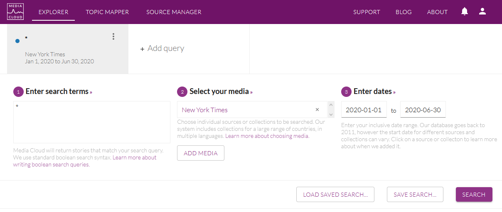
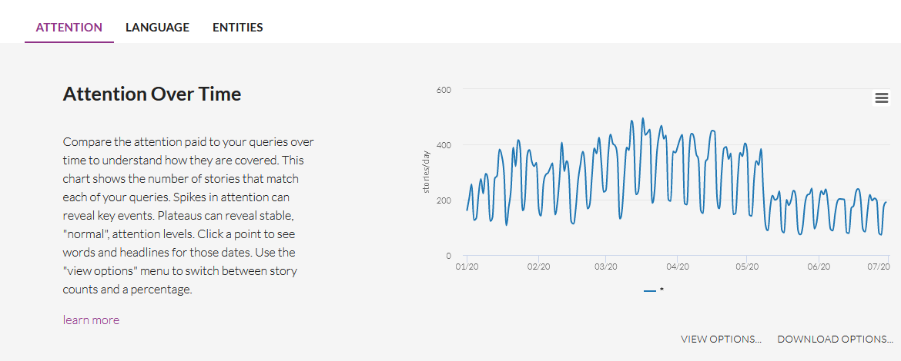

# Collection of titles {#data_title}

```{r, echo=FALSE, message=FALSE, warning=FALSE}
library(knitr)
knitr::opts_chunk$set(echo = FALSE, warning = FALSE, message = FALSE)
library(quanteda)
```

## Introduction {-}

You have different ways to get title of news. We will focus here on a simple example of data obtained through the mediacloud interface. We suppose that you want to analyze the title of the news collected by the New York Times during the first semester of 2020. You can easily proceed to such a collection with the application Mediacloud.

https://explorer.mediacloud.org


## Extraction of data


You need firstly to register (for free) in order to create an account. Then you can select your media, select your period and select all stories by using the request '*' as in the example presented below.

```{r}

```

Below your request, you obtain a graphic entitled *Attention Over Time* with the distribution of the number of news published per day which help you to verify if the distribution of news is regular through time. In our example, you an notice a classical week cycle (with decrease of the number of news publish during the week-end). But you can also observe a discontinuity at the beginning of May 2020 with a decline to a lower level of production of news. 

```{r}

```
Going down, you will find a news panel entitled *Total Attention* which gives you the total number of stories found. In our example, we have a total of 47522 stories produced by the NYT during the first semester of 2020. 

```{r}
knitr::include_graphics("pics/mc003.png")
```

Finally, by clicking on the button *Download all story URLS*, you can get a .csv file that you can easily load in your favorite porgramming language. In the case of R, you can load it with a program like this. 

```{r loadcsv, echo=TRUE}
df<-read.csv(file = "_data/raw/nytime_titles.csv",
             sep=",",
             header=T,
             encoding = "UTF-8",
             stringsAsFactors = F)
str(df)
```
**N.B.** We can notice, without being able to explain this fact, that the number of stories downloaded (30265), which is less than what was announced by the mediacloud interface (47522). May be it is related to the elimination of duplicates ? 

## Transformation in quanteda format.

Currently, the size of the file (unzipped) is equal to 7.3 Mb. But we can observe that a lot of information are the same for all news and should not necessarily be kept. We can also exclude the url field if we are not interested in. We propose therefore to use a better form of storage based on `quanteda` format.

```{r create quanteda, echo=T}
# Create Quanteda corpus
qd<-corpus(df$title)

## Add id
qd$id<-df$stories_id

## Add source code
qd$source<-"nytime"

# Add date
qd$date<-df$publish_date

# add language
qd$lang<-"en"

# add_url
qd$url<-df$url


# Add global meta
meta(qd,"meta_source")<-"Media Cloud "
meta(qd,"meta_time")<-"Download the 2020-07-06"
meta(qd,"meta_author")<-"Elaborated by Claude Grasland"
```


We have created a quanteda object with a lot of information stored in various fields. The structure of the object is the following one

```{r, echo=TRUE}
str(qd)
```

We can look at the first titles with *head()*

```{r, echo=TRUE}
kable(head(qd,3))
```


We can get meta information on each stories with *summary()*

```{r, echo=TRUE}
summary(qd,3)
```

We can get meta information about the full document

```{r, echo=TRUE}
meta(qd)
```


## Storage or exportation

We can finally save the object in .Rdata format in a directory dedicated to our quanteda files. It can be usefull to give some information in the name of the file

```{r, echo=TRUE}
saveRDS(qd,"_data/qd/en_USA_nytime_2020.Rdata")
```

We have kept all the information present in the initial file, but also added specific metadata of interest for us. The size of the storage is now equal to 1.2Mb which means a division by 6 as compared to the initial .csv file downloaded from Media Cloud. 
